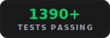

<p align="center">
  
</p>

<p align="center">
  <strong>
    Votre agent de codage se souvient de tout. Fini de tout réexpliquer.
    Built on <a href="https://github.com/iii-hq/iii">iii engine</a>
  </strong><br/>
  Mémoire persistante pour Claude Code, Cursor, Gemini CLI, Codex CLI, Hermes, OpenClaw, pi, OpenCode et tout client MCP.
</p>

<p align="center">
  <a href="../README.md">English</a> |
  <a href="README.zh-CN.md">简体中文</a> |
  <a href="README.zh-TW.md">繁體中文</a> |
  <a href="README.ja-JP.md">日本語</a> |
  <a href="README.ko-KR.md">한국어</a> |
  <a href="README.es-ES.md">Español</a> |
  <a href="README.tr-TR.md">Türkçe</a> |
  <a href="README.ru-RU.md">Русский</a> |
  <a href="README.hi-IN.md">हिन्दी</a> |
  <a href="README.pt-BR.md">Português</a> |
  Français |
  <a href="README.de-DE.md">Deutsch</a>
</p>

<p align="center">
  <a href="https://trendshift.io/repositories/25123" target="_blank"></a>
</p>

<p align="center">
  <a href="https://www.star-history.com/?repos=rohitg00%2Fagentmemory&type=date&legend=top-left">
    <picture>
      <source media="(prefers-color-scheme: dark)" srcset="https://api.star-history.com/chart?repos=rohitg00/ZiiAgentMemory&type=date&theme=dark&legend=top-left" />
      <source media="(prefers-color-scheme: light)" srcset="https://api.star-history.com/chart?repos=rohitg00/ZiiAgentMemory&type=date&legend=top-left" />
      
    </picture>
  </a>
</p>

<p align="center">
  <a href="https://gist.github.com/rohitg00/2067ab416f7bbe447c1977edaaa681e2"></a>
</p>

<p align="center">
  <em>Le gist étend le motif LLM Wiki de Karpathy avec scoring de confiance, cycle de vie, graphes de connaissances et recherche hybride : ZiiAgentMemory en est l'implémentation.</em>
</p>

<p align="center">
  <a href="https://www.npmjs.com/package/ziiagentmemory"></a>
  <a href="https://github.com/ziishanahmad/ziiagentmemory/actions"></a>
  <a href="https://github.com/ziishanahmad/ziiagentmemory/blob/main/LICENSE"></a>
  <a href="https://github.com/ziishanahmad/ziiagentmemory/stargazers"></a>
</p>

<p align="center">
  <picture><source media="(prefers-color-scheme: dark)" srcset="../assets/tags/light/stat-recall.svg"></picture>
  <picture><source media="(prefers-color-scheme: dark)" srcset="../assets/tags/light/stat-tokens.svg"></picture>
  <picture><source media="(prefers-color-scheme: dark)" srcset="../assets/tags/light/stat-tools.svg"></picture>
  <picture><source media="(prefers-color-scheme: dark)" srcset="../assets/tags/light/stat-hooks.svg"></picture>
  <picture><source media="(prefers-color-scheme: dark)" srcset="../assets/tags/light/stat-deps.svg"></picture>
  <picture><source media="(prefers-color-scheme: dark)" srcset="../assets/tags/light/stat-tests.svg"></picture>
</p>

<p align="center">
  
</p>

<p align="center">
  <a href="#install">Installation</a> &bull;
  <a href="#quick-start">Démarrage rapide</a> &bull;
  <a href="#benchmarks">Benchmarks</a> &bull;
  <a href="#vs-competitors">vs Concurrents</a> &bull;
  <a href="#works-with-every-agent">Agents</a> &bull;
  <a href="#how-it-works">Fonctionnement</a> &bull;
  <a href="#mcp-server">MCP</a> &bull;
  <a href="#real-time-viewer">Visualiseur</a> &bull;
  <a href="#iii-console">iii Console</a> &bull;
  <a href="#powered-by-iii">Powered by iii</a> &bull;
  <a href="#configuration">Configuration</a> &bull;
  <a href="#api">API</a>
</p>

---

## Install

```bash
npm install -g ziiagentmemory          # once — bare `ziiagentmemory` on PATH
# If you hit EACCES on macOS/Linux system Node installs, retry with:
# sudo npm install -g ziiagentmemory
ZiiAgentMemory                                      # start the memory server on :3111
ziiagentmemory demo                                 # seed sample sessions + prove recall
ziiagentmemory connect claude-code                  # wire your agent (also: codex, cursor, gemini-cli, ...)
```

Ou via `npx` (sans installation) :

```bash
npx ziiagentmemory
```

À noter — npx met en cache par version. Si un simple `npx ziiagentmemory` sert une version plus ancienne, forcez la dernière avec `npx -y ziiagentmemory@latest`, ou videz le cache une fois avec `rm -rf ~/.npm/_npx` (macOS/Linux ; sur Windows, supprimez `%LOCALAPPDATA%\npm-cache\_npx`). Depuis v0.9.16+, la première exécution npx propose une installation globale inline pour que la commande `ziiagentmemory` soit ensuite disponible partout.

Toutes les options dans [Démarrage rapide](#quick-start) ci-dessous. Câblage spécifique par agent dans [Compatible avec tous les agents](#works-with-every-agent).

---

<h2 id="works-with-every-agent"><picture><source media="(prefers-color-scheme: dark)" srcset="../assets/tags/light/section-agents.svg"></picture></h2>

ZiiAgentMemory fonctionne avec tout agent qui prend en charge les hooks, MCP ou l'API REST. Tous les agents partagent le même serveur de mémoire.

<table>
<tr>
<td align="center" width="12.5%">
<a href="https://claude.com/product/claude-code"></a><br/>
<strong>Claude Code</strong><br/>
<sub>plugin natif + 12 hooks + MCP</sub>
</td>
<td align="center" width="12.5%">
<a href="https://github.com/openai/codex"></a><br/>
<strong>Codex CLI</strong><br/>
<sub>plugin natif + 6 hooks + MCP</sub>
</td>
<td align="center" width="12.5%">
<a href="../integrations/openclaw/"></a><br/>
<strong>OpenClaw</strong><br/>
<sub>plugin natif + MCP</sub>
</td>
<td align="center" width="12.5%">
<a href="../integrations/hermes/"></a><br/>
<strong>Hermes</strong><br/>
<sub>plugin natif + MCP</sub>
</td>
<td align="center" width="12.5%">
<a href="../integrations/pi/"></a><br/>
<strong>pi</strong><br/>
<sub>plugin natif + MCP</sub>
</td>
<td align="center" width="12.5%">
<a href="https://github.com/tinyhumansai/openhuman"></a><br/>
<strong>OpenHuman</strong><br/>
<sub>backend natif trait Memory</sub>
</td>
<td align="center" width="12.5%">
<a href="https://cursor.com"></a><br/>
<strong>Cursor</strong><br/>
<sub>serveur MCP</sub>
</td>
<td align="center" width="12.5%">
<a href="https://github.com/google-gemini/gemini-cli"></a><br/>
<strong>Gemini CLI</strong><br/>
<sub>serveur MCP</sub>
</td>
</tr>
<tr>
<td align="center" width="12.5%">
<a href="https://github.com/opencode-ai/opencode"></a><br/>
<strong>OpenCode</strong><br/>
<sub>22 hooks + MCP + plugin</sub>
</td>
<td align="center" width="12.5%">
<a href="https://github.com/cline/cline"></a><br/>
<strong>Cline</strong><br/>
<sub>serveur MCP</sub>
</td>
<td align="center" width="12.5%">
<a href="https://github.com/block/goose"></a><br/>
<strong>Goose</strong><br/>
<sub>serveur MCP</sub>
</td>
<td align="center" width="12.5%">
<a href="https://github.com/Kilo-Org/kilocode"></a><br/>
<strong>Kilo Code</strong><br/>
<sub>serveur MCP</sub>
</td>
<td align="center" width="12.5%">
<a href="https://github.com/Aider-AI/aider"></a><br/>
<strong>Aider</strong><br/>
<sub>API REST</sub>
</td>
<td align="center" width="12.5%">
<a href="https://claude.ai/download"></a><br/>
<strong>Claude Desktop</strong><br/>
<sub>serveur MCP</sub>
</td>
<td align="center" width="12.5%">
<a href="https://windsurf.com"></a><br/>
<strong>Windsurf</strong><br/>
<sub>serveur MCP</sub>
</td>
<td align="center" width="12.5%">
<a href="https://github.com/RooCodeInc/Roo-Code"></a><br/>
<strong>Roo Code</strong><br/>
<sub>serveur MCP</sub>
</td>
</tr>
</table>

<p align="center">
  <sub>Fonctionne avec <strong>n'importe quel</strong> agent qui parle MCP ou HTTP. Un seul serveur, des mémoires partagées entre tous.</sub>
</p>

---

Vous expliquez la même architecture à chaque session. Vous redécouvrez les mêmes bugs. Vous réenseignez les mêmes préférences. La mémoire intégrée (CLAUDE.md, .cursorrules) plafonne à 200 lignes et devient obsolète. ZiiAgentMemory règle ce problème. Il capture silencieusement ce que fait votre agent, le compresse dans une mémoire interrogeable, puis injecte le bon contexte au démarrage de la session suivante. Une seule commande. Compatible entre agents.

**Ce qui change :** Session 1, vous mettez en place l'authentification JWT. Session 2, vous demandez une limitation de débit. L'agent sait déjà que votre authentification utilise le middleware jose dans `src/middleware/auth.ts`, que vos tests couvrent la validation des tokens, et que vous avez choisi jose plutôt que jsonwebtoken pour la compatibilité Edge. Pas de réexplication. Pas de copier-coller. L'agent *sait*, point.

```bash
npx ziiagentmemory
```

> **Nouveau en v0.9.0** — Site d'accueil sur [agent-memory.dev](https://agent-memory.dev), connecteur système de fichiers (`@ZiiAgentMemory/fs-watcher`), le MCP standalone fait désormais proxy vers le serveur en cours d'exécution afin que les hooks et le visualiseur soient cohérents, politique d'audit codifiée sur tous les chemins de suppression, l'état de santé ne signale plus `memory_critical` sur les petits processus Node. Notes complètes dans [CHANGELOG.md](../CHANGELOG.md#090--2026-04-18).

---

<h2 id="benchmarks"><picture><source media="(prefers-color-scheme: dark)" srcset="../assets/tags/light/section-benchmarks.svg"></picture></h2>

<table>
<tr>
<td width="50%">

### Précision de récupération

**coding-agent-life-v1** (corpus interne, reproductible en sandbox)

| Adaptateur | P@5 | R@5 | Taux de hit top-5 | Latence p50 |
|---|---|---|---|---|
| **ZiiAgentMemory hybrid** | **0.578** | **0.967** | **15 / 15** | 14 ms |
| Référence grep | 0.267 | 0.967 | 15 / 15 | 0 ms |

100 % de taux de hit top-5. **2,2×** meilleure précision que la référence grep sur entrée identique. Ventilation complète par type : [`docs/benchmarks/2026-05-20-coding-agent-life-v1.md`](../docs/benchmarks/2026-05-20-coding-agent-life-v1.md).

**LongMemEval-S** (ICLR 2025, 500 questions)

| Système | R@5 | R@10 | MRR |
|---|---|---|---|
| **ZiiAgentMemory** | **95.2%** | **98.6%** | **88.2%** |
| Repli BM25 seul | 86.2% | 94.6% | 71.5% |

</td>
<td width="50%">

### Économies de tokens

| Approche | Tokens/an | Coût/an |
|---|---|---|
| Coller le contexte complet | 19,5M+ | Impossible (dépasse la fenêtre) |
| Résumé par LLM | ~650K | ~500 $ |
| **ZiiAgentMemory** | **~170K** | **~10 $** |
| ZiiAgentMemory + embeddings locaux | ~170K | **0 $** |

</td>
</tr>
</table>

> Modèle d'embedding : `all-MiniLM-L6-v2` (local, gratuit, aucune clé d'API). Rapports complets : [`benchmark/LONGMEMEVAL.md`](../benchmark/LONGMEMEVAL.md), [`benchmark/QUALITY.md`](../benchmark/QUALITY.md), [`benchmark/SCALE.md`](../benchmark/SCALE.md). Comparaison avec les concurrents : [`benchmark/COMPARISON.md`](../benchmark/COMPARISON.md) — ZiiAgentMemory vs mem0, Letta, Khoj, claude-mem, Hippo.

**Reproduire localement :** [`eval/README.md`](../eval/README.md) — harnais à adaptateurs pluggables pour LongMemEval `_s` (public, 500 questions) + `coding-agent-life-v1` (corpus interne de 15 sessions). Les adaptateurs grep / vectoriel / ZiiAgentMemory sont scorés côte à côte, sortie NDJSON, scorecards publiés dans [`docs/benchmarks/`](../docs/benchmarks/).

**À associer à [codegraph](https://github.com/colbymchenry/codegraph), [Understand Anything](https://github.com/Lum1104/Understand-Anything) et [Graphify](https://github.com/safishamsi/graphify).** Indexation de graphe de code, pipelines de build multi-agents et graphes de connaissances étendus sur docs / PDFs / images / vidéos. ZiiAgentMemory mémorise le travail ; ces trois projets éclairent le reste de la couche de contexte. Recettes et tableau de routage des questions : [`docs/recipes/pairings.md`](../docs/recipes/pairings.md).

---

<h2 id="vs-competitors"><picture><source media="(prefers-color-scheme: dark)" srcset="../assets/tags/light/section-competitors.svg"></picture></h2>

<table>
<tr>
<th width="20%"></th>
<th width="20%">ZiiAgentMemory</th>
<th width="20%">mem0 (53K ⭐)</th>
<th width="20%">Letta / MemGPT (22K ⭐)</th>
<th width="20%">Intégré (CLAUDE.md)</th>
</tr>
<tr>
<td><strong>Type</strong></td>
<td>Moteur de mémoire + serveur MCP</td>
<td>API de couche mémoire</td>
<td>Runtime d'agent complet</td>
<td>Fichier statique</td>
</tr>
<tr>
<td><strong>R@5 de récupération</strong></td>
<td><strong>95.2%</strong></td>
<td>68.5% (LoCoMo)</td>
<td>83.2% (LoCoMo)</td>
<td>N/A (grep)</td>
</tr>
<tr>
<td><strong>Capture automatique</strong></td>
<td>12 hooks (zéro effort manuel)</td>
<td>Appels <code>add()</code> manuels</td>
<td>L'agent s'édite lui-même</td>
<td>Édition manuelle</td>
</tr>
<tr>
<td><strong>Recherche</strong></td>
<td>BM25 + Vectoriel + Graphe (fusion RRF)</td>
<td>Vectoriel + Graphe</td>
<td>Vectoriel (archival)</td>
<td>Charge tout en contexte</td>
</tr>
<tr>
<td><strong>Multi-agents</strong></td>
<td>MCP + REST + leases + signaux</td>
<td>API (sans coordination)</td>
<td>Uniquement dans le runtime Letta</td>
<td>Fichiers par agent</td>
</tr>
<tr>
<td><strong>Verrouillage framework</strong></td>
<td>Aucun (tout client MCP)</td>
<td>Aucun</td>
<td>Élevé (Letta obligatoire)</td>
<td>Format par agent</td>
</tr>
<tr>
<td><strong>Dépendances externes</strong></td>
<td>Aucune (SQLite + iii-engine)</td>
<td>Qdrant / pgvector</td>
<td>Postgres + base vectorielle</td>
<td>Aucune</td>
</tr>
<tr>
<td><strong>Cycle de vie mémoire</strong></td>
<td>Consolidation à 4 niveaux + décroissance + oubli automatique</td>
<td>Extraction passive</td>
<td>Gérée par l'agent</td>
<td>Élagage manuel</td>
</tr>
<tr>
<td><strong>Efficacité en tokens</strong></td>
<td>~1 900 tokens/session (10 $/an)</td>
<td>Variable selon l'intégration</td>
<td>Mémoire centrale dans le contexte</td>
<td>22K+ tokens à 240 observations</td>
</tr>
<tr>
<td><strong>Visualiseur temps réel</strong></td>
<td>Oui (port 3113)</td>
<td>Tableau de bord cloud</td>
<td>Tableau de bord cloud</td>
<td>Non</td>
</tr>
<tr>
<td><strong>Auto-hébergé</strong></td>
<td>Oui (par défaut)</td>
<td>Optionnel</td>
<td>Optionnel</td>
<td>Oui</td>
</tr>
</table>

---

<h2 id="quick-start"><picture><source media="(prefers-color-scheme: dark)" srcset="../assets/tags/light/section-quickstart.svg"></picture></h2>

Compatibilité : cette version cible `iii-sdk` stable `^0.11.0` et iii-engine v0.11.x.

### Essayez en 30 secondes

```bash
# Terminal 1: start the server
npx ziiagentmemory

# Terminal 2: seed sample data and see recall in action
npx ziiagentmemory demo
```

`demo` amorce 3 sessions réalistes (auth JWT, correctif de requêtes N+1, limitation de débit) et lance des recherches sémantiques dessus. Vous verrez le système trouver « N+1 query fix » quand vous cherchez « database performance optimization » — la correspondance par mots-clés en est incapable.

Ouvrez `http://localhost:3113` pour voir la mémoire se construire en direct.

### Recommandé : installation globale

`npx` met en cache par version. Si vous avez lancé `npx ziiagentmemory@0.9.14` la semaine dernière, un simple `npx ziiagentmemory` peut servir le 0.9.14 obsolète depuis `~/.npm/_npx/`, pas la dernière version. Installez une fois et la commande `ziiagentmemory` est disponible partout :

```bash
npm install -g ziiagentmemory
# If you hit EACCES on macOS/Linux system Node installs, retry with:
# sudo npm install -g ziiagentmemory
ZiiAgentMemory                    # start the server (same as the npx form)
ziiagentmemory stop               # tear it down
ziiagentmemory remove             # uninstall everything we created
ziiagentmemory connect claude-code   # wire one agent
ziiagentmemory doctor             # interactive diagnostics + fix prompts
```

À partir de v0.9.16, la première exécution npx propose une installation globale inline — répondez `Y` une fois et c'est réglé. Si vous passez l'étape, repliez sur l'une de ces options pour un fetch frais :

```bash
npx -y ziiagentmemory@latest                 # forces latest from npm (cross-platform)
rm -rf ~/.npm/_npx && npx ziiagentmemory     # macOS/Linux only (POSIX shell)
```

Sur Windows / PowerShell, l'équivalent pour vider le cache est `Remove-Item -Recurse -Force "$env:LOCALAPPDATA\npm-cache\_npx"` — le `npx -y ...@latest` ci-dessus reste l'option multiplateforme.

### Replay de session

Chaque session enregistrée par ZiiAgentMemory est rejouable. Ouvrez le visualiseur, choisissez l'onglet **Replay**, et parcourez la chronologie : prompts, appels d'outils, résultats d'outils et réponses s'affichent comme événements discrets avec play/pause, contrôle de vitesse (0,5×–4×) et raccourcis clavier (espace pour basculer, flèches pour avancer).

Vous avez déjà d'anciennes transcriptions JSONL Claude Code à importer ?

```bash
# Import everything under the default ~/.claude/projects
npx ziiagentmemory import-jsonl

# Or import a single file
npx ziiagentmemory import-jsonl ~/.claude/projects/-my-project/abc123.jsonl
```

Les sessions importées apparaissent dans le sélecteur Replay aux côtés des natives. Sous le capot, chaque entrée passe par les fonctions iii `mem::replay::load`, `mem::replay::sessions` et `mem::replay::import-jsonl` — aucun serveur secondaire.

### Mise à niveau / Maintenance

Utilisez la commande de maintenance lorsque vous voulez intentionnellement mettre à jour votre runtime local :

```bash
npx ziiagentmemory upgrade
```

Avertissement : cette commande modifie l'espace de travail / runtime courant. Elle peut mettre à jour les dépendances JavaScript et tirer l'image Docker épinglée `iiidev/iii:0.11.2`. Elle n'installe jamais un moteur iii non épinglé ou plus récent.

Détails d'implémentation dans `src/cli.ts` (voir `runUpgrade` autour de la zone `src/cli.ts:544-595`).

### Claude Code (un seul bloc, à coller)

```text
Install ZiiAgentMemory: run `npx ziiagentmemory` in a separate terminal to start the memory server. Then run `/plugin marketplace add rohitg00/ZiiAgentMemory` and `/plugin install ZiiAgentMemory` — the plugin registers all 12 hooks, 4 skills, AND auto-wires the `ziiagentmemory` stdio server via its `.mcp.json`, so you get 53 MCP tools (memory_smart_search, memory_save, memory_sessions, memory_governance_delete, etc.) without any extra config step. Verify with `curl http://localhost:3111/ziiagentmemory/health`. The real-time viewer is at http://localhost:3113.
```

#### Claude Code sans installation du plugin (chemin MCP-standalone)

Si vous câblez le serveur MCP d'ZiiAgentMemory via `~/.claude.json` directement plutôt que via `/plugin install`, Claude Code ne résout jamais `${CLAUDE_PLUGIN_ROOT}` et vous devez pointer les scripts de hooks vers des chemins absolus dans `~/.claude/settings.json`. Ces chemins embarquent typiquement la version d'ZiiAgentMemory (par ex. `~/.codex/plugins/cache/ziiagentmemory/ziiagentmemory/0.9.21/scripts/…`), si bien que la mise à niveau suivante casse silencieusement tous les hooks.

Contournement :

```bash
ziiagentmemory connect claude-code --with-hooks
```

Cela fusionne les mêmes commandes de hooks dans `~/.claude/settings.json` avec des chemins absolus résolus vers le répertoire `plugin/` du paquet `ziiagentmemory` actuellement installé. Relancez la commande après une mise à niveau d'ZiiAgentMemory pour rafraîchir les chemins. Les entrées de l'utilisateur dans le même fichier sont préservées ; seules les entrées ZiiAgentMemory précédentes sont remplacées. Utiliser le chemin `/plugin install` reste l'approche recommandée.
Pour des déploiements distants ou protégés, lancez Claude Code avec `ZIIAGENTMEMORY_URL` et `ZIIAGENTMEMORY_SECRET` définis. Le plugin transmet les deux valeurs à son serveur MCP intégré ; quand `ZIIAGENTMEMORY_URL` est vide, le shim MCP utilise `http://localhost:3111`.

### Codex CLI (plateforme de plugins Codex)

```bash
# 1. start the memory server in a separate terminal
npx ziiagentmemory

# 2. register the ZiiAgentMemory marketplace and install the plugin
codex plugin marketplace add ziishanahmad/ziiagentmemory
codex plugin add ZiiAgentMemory@ZiiAgentMemory
```

Le plugin Codex est livré depuis le même répertoire `plugin/` que le plugin Claude Code. Il enregistre :

- `ziiagentmemory` comme serveur MCP (proxie les 51 outils lorsque `ZIIAGENTMEMORY_URL` pointe vers un serveur ZiiAgentMemory actif ; retombe sur 7 outils en local si aucun serveur n'est accessible)
- 6 hooks de cycle de vie : `SessionStart`, `UserPromptSubmit`, `PreToolUse`, `PostToolUse`, `PreCompact`, `Stop`
- 4 skills : `/recall`, `/remember`, `/session-history`, `/forget`

Le moteur de hooks de Codex injecte `CLAUDE_PLUGIN_ROOT` dans les sous-processus de hooks (cf. [`codex-rs/hooks/src/engine/discovery.rs`](https://github.com/openai/codex/blob/main/codex-rs/hooks/src/engine/discovery.rs)), donc les mêmes scripts de hooks fonctionnent sur les deux hôtes sans duplication. Les événements Subagent / SessionEnd / Notification / TaskCompleted / PostToolUseFailure sont propres à Claude Code et ne sont pas enregistrés pour Codex.

#### Codex Desktop : hooks de plugin actuellement silencieux (contournement disponible)

`CodexHooks` et `PluginHooks` sont tous deux stables + activés par défaut dans [`codex-rs/features/src/lib.rs`](https://github.com/openai/codex/blob/main/codex-rs/features/src/lib.rs), mais les builds Codex Desktop actuels ne dispatchent pas les `hooks.json` locaux au plugin ([openai/codex#16430](https://github.com/openai/codex/issues/16430)). Les outils MCP fonctionnent toujours ; seules les observations de cycle de vie manquent.

En attendant le correctif amont, dupliquez les mêmes commandes de hooks dans le `~/.codex/hooks.json` global :

```bash
ziiagentmemory connect codex --with-hooks
```

Cela ajoute un bloc idempotent à `~/.codex/hooks.json` qui référence des chemins absolus vers les scripts intégrés (pas besoin d'expansion `${CLAUDE_PLUGIN_ROOT}` au scope utilisateur). Relancez la même commande après une mise à niveau d'ZiiAgentMemory pour rafraîchir les chemins. Les entrées de l'utilisateur dans le même fichier sont préservées ; seules les entrées ZiiAgentMemory précédentes sont remplacées.

<details>
<summary><b>OpenClaw (collez ce prompt)</b></summary>

```text
Install ZiiAgentMemory for OpenClaw. Run `npx ziiagentmemory` in a separate terminal to start the memory server on localhost:3111. Then add this to my OpenClaw MCP config so ZiiAgentMemory is available with all 51 memory tools:

{
  "mcpServers": {
    "ZiiAgentMemory": {
      "command": "npx",
      "args": ["-y", "ziiagentmemory"],
      "env": {
        "ZIIAGENTMEMORY_URL": "http://localhost:3111"
      }
    }
  }
}

Restart OpenClaw. Verify with `curl http://localhost:3111/ziiagentmemory/health`. Open http://localhost:3113 for the real-time viewer. For deeper memory-slot integration, copy `integrations/openclaw` to `~/.openclaw/extensions/ZiiAgentMemory` and enable `plugins.slots.memory = "ZiiAgentMemory"` in `~/.openclaw/openclaw.json`.
```

Guide complet : [`integrations/openclaw/`](../integrations/openclaw/)

</details>

<details>
<summary><b>Hermes Agent (collez ce prompt)</b></summary>

```text
Install ZiiAgentMemory for Hermes. Run `npx ziiagentmemory` in a separate terminal to start the memory server on localhost:3111. Then add this to ~/.hermes/config.yaml so Hermes can use ZiiAgentMemory as an MCP server with all 51 memory tools:

mcp_servers:
  ZiiAgentMemory:
    command: npx
    args: ["-y", "ziiagentmemory"]

memory:
  provider: ZiiAgentMemory

Verify with `curl http://localhost:3111/ziiagentmemory/health`. Open http://localhost:3113 for the real-time viewer. For deeper 6-hook memory provider integration (pre-LLM context injection, turn capture, MEMORY.md mirroring, system prompt block), copy integrations/hermes from the ZiiAgentMemory repo to ~/.hermes/plugins/ZiiAgentMemory.
```

Guide complet : [`integrations/hermes/`](../integrations/hermes/)

</details>

### Autres agents

Démarrez le serveur de mémoire : `npx ziiagentmemory`

L'entrée ZiiAgentMemory est le **même bloc serveur MCP** pour tous les hôtes utilisant le format `mcpServers` (Cursor, Claude Desktop, Cline, Roo Code, Windsurf, Gemini CLI, OpenClaw) :

```json
"ZiiAgentMemory": {
  "command": "npx",
  "args": ["-y", "ziiagentmemory"],
  "env": {
    "ZIIAGENTMEMORY_URL": "${ZIIAGENTMEMORY_URL}",
    "ZIIAGENTMEMORY_SECRET": "${ZIIAGENTMEMORY_SECRET}"
  }
}
```

**Fusionnez cette entrée dans l'objet `mcpServers` existant** du fichier de config de l'hôte — ne remplacez pas le fichier. Si le fichier contient déjà d'autres serveurs, ajoutez `ziiagentmemory` à côté d'eux comme nouvelle clé dans `mcpServers`. Si `mcpServers` est totalement absent, collez le bloc dans `{ "mcpServers": { ... } }`. Les placeholders `${VAR}` héritent de `ZIIAGENTMEMORY_URL` / `ZIIAGENTMEMORY_SECRET` depuis le shell au lancement du serveur MCP — des vars non définies passent des chaînes vides et le shim retombe sur `http://localhost:3111`. Une seule entrée câblée couvre à la fois les déploiements locaux et distants (k8s / reverse-proxy).

| Agent | Fichier de config | Notes |
|---|---|---|
| **Cursor** | `~/.cursor/mcp.json` | Fusionner dans `mcpServers`. Deeplink en un clic également disponible sur le site web. |
| **Claude Desktop** | `claude_desktop_config.json` (Application Support) | Fusionner dans `mcpServers`. Redémarrer Claude Desktop après modification. |
| **Cline / Roo Code / Kilo Code** | Paramètres MCP de Cline (Settings UI → MCP Servers → Edit) | Même bloc `mcpServers`. |
| **Windsurf** | `~/.codeium/windsurf/mcp_config.json` | Même bloc `mcpServers`. |
| **Gemini CLI** | `~/.gemini/settings.json` | `gemini mcp add ZiiAgentMemory npx -y ziiagentmemory --scope user` (fusion automatique). |
| **OpenClaw** | Config MCP d'OpenClaw | Même bloc `mcpServers`, ou utilisez le [plugin mémoire plus poussé](../integrations/openclaw/). |
| **Codex CLI (MCP seul)** | `.codex/config.toml` | Format TOML : `codex mcp add ZiiAgentMemory -- npx -y ziiagentmemory`, ou ajoutez `[mcp_servers.ZiiAgentMemory]` à la main. |
| **Codex CLI (plugin complet)** | Marketplace de plugins Codex | `codex plugin marketplace add rohitg00/ZiiAgentMemory` puis `codex plugin add ZiiAgentMemory@ZiiAgentMemory`. Enregistre MCP + 6 hooks de cycle de vie (SessionStart, UserPromptSubmit, PreToolUse, PostToolUse, PreCompact, Stop) + 4 skills. Sur Codex Desktop, lancez également `ziiagentmemory connect codex --with-hooks` en attendant que [openai/codex#16430](https://github.com/openai/codex/issues/16430) soit corrigé — les hooks de plugin y sont actuellement silencieux. |
| **OpenCode (MCP seul)** | `opencode.json` | Format différent — clé `mcp` au niveau racine, commande sous forme de tableau : `{"mcp": {"ZiiAgentMemory": {"type": "local", "command": ["npx", "-y", "ziiagentmemory"], "enabled": true}}}`. |
| **OpenCode (plugin complet)** | `plugin/opencode/` | 22 hooks de capture automatique couvrant cycle de vie de session, messages, outils, erreurs. Deux commandes slash (`/recall`, `/remember`). Copiez `plugin/opencode/` dans votre workspace OpenCode et ajoutez l'entrée du plugin à `opencode.json`. Voir [`plugin/opencode/README.md`](../plugin/opencode/README.md) pour le tableau complet des hooks et l'analyse des manques. |
| **pi** | `~/.pi/agent/extensions/ZiiAgentMemory` | Copiez [`integrations/pi`](../integrations/pi/) et redémarrez pi. |
| **Hermes Agent** | `~/.hermes/config.yaml` | Utilisez le [plugin de fournisseur de mémoire plus poussé](../integrations/hermes/) avec `memory.provider: ZiiAgentMemory`. |
| **Qwen Code** | `~/.qwen/settings.json` | `ziiagentmemory connect qwen` écrit le bloc `mcpServers` standard. La charge utile des hooks est compatible champ-à-champ avec Claude Code, donc les 12 scripts de hooks existants fonctionnent sans modification — câblez-les via la section `hooks` du même `settings.json`. |
| **Antigravity** (remplace Gemini CLI) | `mcp_config.json` (dans le répertoire User d'Antigravity) | `ziiagentmemory connect antigravity` écrit le bloc `mcpServers` standard. macOS : `~/Library/Application Support/Antigravity/User/`. Linux : `~/.config/Antigravity/User/`. À utiliser après l'arrêt de Gemini CLI au 2026-06-18. |
| **Kiro** | `~/.kiro/settings/mcp.json` | `ziiagentmemory connect kiro` écrit la config au niveau utilisateur. Les overrides de workspace vont dans `.kiro/settings/mcp.json` à côté de votre code. |
| **Goose** | UI des paramètres MCP de Goose | Même bloc `mcpServers`. |
| **Aider** | n/a | Parlez directement à l'API REST : `curl -X POST http://localhost:3111/ziiagentmemory/smart-search -d '{"query": "auth"}'`. |
| **Tout agent (32+)** | n/a | `npx skillkit install ZiiAgentMemory` détecte l'hôte automatiquement et fusionne. |

**Clients MCP en sandbox** (Flatpak / Snap / conteneurs restrictifs) qui ne peuvent pas joindre le `localhost` de l'hôte : définissez également `"ZIIAGENTMEMORY_FORCE_PROXY": "1"` dans le bloc `env` et pointez `ZIIAGENTMEMORY_URL` vers une route que la sandbox peut effectivement atteindre (par ex. votre IP LAN).

### Accès programmatique (Python / Rust / Node)

ZiiAgentMemory enregistre ses opérations principales en tant que fonctions iii (`mem::remember`, `mem::observe`, `mem::context`, `mem::smart-search`, `mem::forget`). N'importe quel langage doté d'un SDK iii peut les appeler directement sur `ws://localhost:49134` — pas besoin de client REST séparé par langage.

```bash
pip install iii-sdk         # Python
cargo add iii-sdk           # Rust
npm  install iii-sdk        # Node
```

```python
from iii import register_worker

iii = register_worker("ws://localhost:49134")
iii.connect()

iii.trigger({
    "function_id": "mem::smart-search",
    "payload": {"project": "demo", "query": "how do tokens refresh"},
})
```

Exemple complet : [`examples/python/`](../examples/python/) (quickstart + flux observation/recall). REST sur `:3111` reste disponible pour les hôtes sans runtime iii.

### Depuis les sources

```bash
git clone https://github.com/ziishanahmad/ziiagentmemory.git && cd ZiiAgentMemory
npm install && npm run build && npm start
```

Cela démarre ZiiAgentMemory avec un `iii-engine` local si `iii` est déjà installé, ou retombe sur Docker Compose si Docker est disponible. REST, streams et visualiseur se lient à `127.0.0.1` par défaut.

Installer `iii-engine` manuellement. **ZiiAgentMemory épingle actuellement `iii-engine` à `v0.11.2`** — `v0.11.6` introduit un nouveau modèle de sandboxing systématique via `iii worker add` pour lequel ZiiAgentMemory n'a pas encore été refactorisé. L'épinglage sera levé une fois la refonte effectuée. Surchargez avec `ZIIAGENTMEMORY_III_VERSION=<version>` si vous avez migré au modèle sandbox manuellement.

- **macOS arm64 :** `mkdir -p ~/.local/bin && curl -fsSL https://github.com/iii-hq/iii/releases/download/iii/v0.11.2/iii-aarch64-apple-darwin.tar.gz | tar -xz -C ~/.local/bin && chmod +x ~/.local/bin/iii`
- **macOS x64 :** remplacez `aarch64-apple-darwin` par `x86_64-apple-darwin`
- **Linux x64 :** remplacez par `x86_64-unknown-linux-gnu`
- **Linux arm64 :** remplacez par `aarch64-unknown-linux-gnu`
- **Windows :** téléchargez `iii-x86_64-pc-windows-msvc.zip` depuis [iii-hq/iii releases v0.11.2](https://github.com/iii-hq/iii/releases/tag/iii%2Fv0.11.2), extrayez `iii.exe`, ajoutez-le au PATH

Ou utilisez Docker (le `docker-compose.yml` fourni tire `iiidev/iii:0.11.2`). Documentation complète : [iii.dev/docs](https://iii.dev/docs).

### Windows

ZiiAgentMemory tourne sur Windows 10/11, mais le paquet Node.js seul ne suffit pas — il vous faut aussi le runtime `iii-engine` (un binaire natif séparé) comme processus en arrière-plan. L'installeur amont officiel est un script `sh` et il n'existe à ce jour ni installeur PowerShell ni paquet scoop/winget, donc les utilisateurs Windows ont deux chemins :

**Option A — Binaire Windows précompilé (recommandé) :**

```powershell
# 1. Open https://github.com/iii-hq/iii/releases/tag/iii%2Fv0.11.2 in your browser
#    (we pin to v0.11.2 until ZiiAgentMemory refactors for the new sandbox
#     model that engine v0.11.6+ requires)
# 2. Download iii-x86_64-pc-windows-msvc.zip
#    (or iii-aarch64-pc-windows-msvc.zip if you're on an ARM machine)
# 3. Extract iii.exe somewhere on PATH, or place it at:
#    %USERPROFILE%\.local\bin\iii.exe
#    (ZiiAgentMemory checks that location automatically)
# 4. Verify:
iii --version
# Should print: 0.11.2

# 5. Then run ZiiAgentMemory as usual:
npx -y ziiagentmemory
```

**Option B — Docker Desktop :**

```powershell
# 1. Install Docker Desktop for Windows
# 2. Start Docker Desktop and make sure the engine is running
# 3. Run ZiiAgentMemory — it will auto-start the bundled compose file:
npx -y ziiagentmemory
```

**Option C — MCP standalone uniquement (sans moteur) :** si vous n'avez besoin que des outils MCP pour votre agent et pas de l'API REST, du visualiseur ou des jobs cron, sautez le moteur :

```powershell
npx -y ziiagentmemory mcp
# or via the shim package:
npx -y ziiagentmemory
```

**Diagnostics pour Windows :** si `npx ziiagentmemory` échoue, relancez avec `--verbose` pour voir le stderr réel du moteur. Modes de défaillance courants :

| Symptôme | Correctif |
|---|---|
| `iii-engine process started` puis `did not become ready within 15s` | Le moteur a planté au démarrage — relancez avec `--verbose`, vérifiez stderr |
| `Could not start iii-engine` | Ni `iii.exe` ni Docker installés. Voir les options A ou B ci-dessus |
| Conflit de port | `netstat -ano \| findstr :3111` pour voir ce qui est lié, puis tuez-le ou utilisez `--port <N>` |
| Fallback Docker ignoré bien que Docker soit installé | Assurez-vous que Docker Desktop tourne effectivement (icône de la barre d'état système) |

> Note : le **moteur** iii est un binaire précompilé, pas un crate cargo — n'essayez pas de l'installer avec `cargo install`. (Les **SDK** iii sont bien publiés sur crates.io, npm et PyPI, mais ZiiAgentMemory n'en a pas besoin.) Méthodes d'installation du moteur supportées, toutes épinglées à v0.11.2 : le binaire précompilé v0.11.2 ci-dessus, le script d'installation `sh` amont **avec l'épingle de version** `curl -fsSL https://install.iii.dev/iii/main/install.sh | VERSION=0.11.2 sh` (macOS/Linux) et l'image Docker `iiidev/iii:0.11.2`. Un simple `install.sh | sh` installe le moteur **le plus récent**, que ZiiAgentMemory ne supporte pas — passez toujours `VERSION=0.11.2`. Le plus simple de tout : exécutez simplement `npx ziiagentmemory`, qui récupère le moteur épinglé dans `~/.ziiagentmemory/bin` pour vous.

---

<h2 id="deploy">Déploiement</h2>

Templates en un clic pour les hébergeurs managés. Chacun livre un Dockerfile
autonome qui récupère `ziiagentmemory` depuis npm et copie le
binaire iii engine depuis l'image officielle `iiidev/iii` du Docker
Hub — pas d'image ZiiAgentMemory précompilée requise. Le stockage
persistant se monte sur `/data` ; le point d'entrée au premier
démarrage réécrit la config iii livrée par npm (qui se lie à
`127.0.0.1`) par une version réglée pour le déploiement qui se lie à
`0.0.0.0` et utilise des chemins absolus `/data`, génère le secret HMAC,
puis abaisse les privilèges de `root` à `node` via `gosu` avant
d'exec'er la CLI ZiiAgentMemory.

<p>
  <a href="https://fly.io/launch?repo=https://github.com/rohitg00/ZiiAgentMemory&path=deploy/fly"></a>
  <a href="https://railway.com/new/template?template=https%3A%2F%2Fgithub.com%2Frohitg00%2Fagentmemory&rootDirectory=deploy%2Frailway"></a>
</p>

Le bouton de déploiement en un clic de Render exige un `render.yaml` à la racine du dépôt, que nous gardons délibérément propre. Utilisez le flux Render Blueprint documenté dans [`deploy/render/`](./deploy/render/README.md) pour pointer manuellement vers le blueprint dans le dépôt.

Détails complets de configuration (capture HMAC, tunnel SSH du visualiseur, rotation, sauvegarde, plafonds de coût) dans [`deploy/`](./deploy/README.md) :

- [`deploy/fly`](./deploy/fly/README.md) — machine unique avec
  `auto_stop_machines = "stop"` ; le moins cher à l'arrêt.
- [`deploy/railway`](./deploy/railway/README.md) — forfait Hobby à tarif fixe,
  volume dans le tableau de bord.
- [`deploy/render`](./deploy/render/README.md) — flux Blueprint,
  snapshots disque automatiques sur les forfaits payants.
- [`deploy/coolify`](./deploy/coolify/README.md) — auto-hébergé sur votre
  propre VPS via [Coolify](https://coolify.io/self-hosted) ; même stack
  Docker Compose, vous possédez l'hôte et les données.

Seul le port `3111` est publié. Le visualiseur sur `3113` reste lié à la
boucle locale dans le conteneur — chaque README de template documente
le motif tunnel SSH pour y accéder.

---

<h2 id="why-ZiiAgentMemory"><picture><source media="(prefers-color-scheme: dark)" srcset="../assets/tags/light/section-why.svg"></picture></h2>

Chaque agent de codage oublie tout quand la session se termine. Vous perdez les 5 premières minutes de chaque session à réexpliquer votre stack. ZiiAgentMemory tourne en arrière-plan et élimine totalement cette perte.

```text
Session 1: "Add auth to the API"
  Agent writes code, runs tests, fixes bugs
  ZiiAgentMemory silently captures every tool use
  Session ends -> observations compressed into structured memory

Session 2: "Now add rate limiting"
  Agent already knows:
    - Auth uses JWT middleware in src/middleware/auth.ts
    - Tests in test/auth.test.ts cover token validation
    - You chose jose over jsonwebtoken for Edge compatibility
  Zero re-explaining. Starts working immediately.
```

### vs mémoire d'agent intégrée

Chaque agent de codage IA est livré avec une mémoire intégrée — Claude Code a `MEMORY.md`, Cursor a des notepads, Cline a memory bank. Cela fonctionne comme des post-it. ZiiAgentMemory est la base de données interrogeable derrière les post-it.

| | Intégrée (CLAUDE.md) | ZiiAgentMemory |
|---|---|---|
| Échelle | Plafond de 200 lignes | Illimitée |
| Recherche | Charge tout en contexte | BM25 + vecteur + graphe (top-K seul) |
| Coût en tokens | 22K+ à 240 observations | ~1 900 tokens (92 % de moins) |
| Inter-agents | Fichiers par agent | MCP + REST (n'importe quel agent) |
| Coordination | Aucune | Leases, signaux, actions, routines |
| Observabilité | Lire les fichiers à la main | Visualiseur temps réel sur :3113 |

---

<h2 id="how-it-works"><picture><source media="(prefers-color-scheme: dark)" srcset="../assets/tags/light/section-how.svg"></picture></h2>

### Pipeline mémoire

```text
PostToolUse hook fires
  -> SHA-256 dedup (5min window)
  -> Privacy filter (strip secrets, API keys)
  -> Store raw observation
  -> LLM compress -> structured facts + concepts + narrative
  -> Vector embedding (6 providers + local)
  -> Index in BM25 + vector

Stop / SessionEnd hook fires
  -> Summarize session
  -> Knowledge graph extraction (if GRAPH_EXTRACTION_ENABLED=true)
  -> Slot reflection (if SLOT_REFLECT_ENABLED=true)

SessionStart hook fires
  -> Load project profile (top concepts, files, patterns)
  -> Hybrid search (BM25 + vector + graph)
  -> Token budget (default: 2000 tokens)
  -> Inject into conversation
```

### Consolidation mémoire à 4 niveaux

Inspirée de la façon dont le cerveau humain traite la mémoire — pas si éloignée de la consolidation pendant le sommeil.

| Niveau | Quoi | Analogie |
|------|------|---------|
| **Working** | Observations brutes issues de l'usage des outils | Mémoire à court terme |
| **Episodic** | Résumés de session compressés | « Ce qui s'est passé » |
| **Semantic** | Faits et motifs extraits | « Ce que je sais » |
| **Procedural** | Workflows et motifs de décision | « Comment faire » |

Les mémoires décroissent dans le temps (courbe d'Ebbinghaus). Les mémoires fréquemment consultées se renforcent. Les mémoires obsolètes sont évincées automatiquement. Les contradictions sont détectées et résolues.

### Ce qui est capturé

| Hook | Capture |
|------|----------|
| `SessionStart` | Chemin de projet, ID de session |
| `UserPromptSubmit` | Prompts utilisateur (filtrés pour la vie privée) |
| `PreToolUse` | Motifs d'accès fichier + contexte enrichi |
| `PostToolUse` | Nom de l'outil, entrée, sortie |
| `PostToolUseFailure` | Contexte d'erreur |
| `PreCompact` | Réinjecte la mémoire avant compaction |
| `SubagentStart/Stop` | Cycle de vie des sous-agents |
| `Stop` | Résumé de fin de session |
| `SessionEnd` | Marqueur de fin de session |

### Capacités clés

| Capacité | Description |
|---|---|
| **Capture automatique** | Chaque usage d'outil enregistré via hooks — zéro effort manuel |
| **Recherche sémantique** | BM25 + vecteur + graphe de connaissances avec fusion RRF |
| **Évolution de la mémoire** | Versioning, supersession, graphes de relations |
| **Oubli automatique** | Expiration TTL, détection de contradictions, éviction par importance |
| **Vie privée d'abord** | Clés d'API, secrets, balises `<private>` retirés avant stockage |
| **Auto-réparation** | Circuit breaker, chaîne de repli de fournisseur, surveillance de santé |
| **Pont Claude** | Synchronisation bidirectionnelle avec MEMORY.md |
| **Graphe de connaissances** | Extraction d'entités + parcours BFS |
| **Mémoire d'équipe** | Partagée + privée par namespace entre membres de l'équipe |
| **Provenance des citations** | Tracer toute mémoire jusqu'aux observations sources |
| **Snapshots git** | Version, rollback et diff de l'état mémoire |

---

<h2 id="search"><picture><source media="(prefers-color-scheme: dark)" srcset="../assets/tags/light/section-search.svg"></picture></h2>

Récupération triple-flux combinant trois signaux :

| Flux | Ce qu'il fait | Quand |
|---|---|---|
| **BM25** | Correspondance par mots-clés racinisés avec expansion par synonymes | Toujours actif |
| **Vector** | Similarité cosinus sur embeddings denses | Fournisseur d'embedding configuré |
| **Graph** | Parcours du graphe de connaissances par correspondance d'entités | Entités détectées dans la requête |

Fusionnés par Reciprocal Rank Fusion (RRF, k=60) et diversifiés par session (max 3 résultats par session).

BM25 tokenise nativement le grec, le cyrillique, l'hébreu, l'arabe et le latin accentué. Pour des mémoires en chinois / japonais / coréen, installez les segmenteurs optionnels (`npm install @node-rs/jieba tiny-segmenter`) afin de découper les suites CJK en tokens au niveau du mot ; sans eux, ZiiAgentMemory retombe doucement sur une tokenisation par suite entière et imprime un message indicatif unique sur stderr.

### Fournisseurs d'embedding

ZiiAgentMemory détecte automatiquement votre fournisseur. Pour de meilleurs résultats, installez les embeddings locaux (gratuits) :

```bash
npm install @xenova/transformers
```

| Fournisseur | Modèle | Coût | Notes |
|---|---|---|---|
| **Local (recommandé)** | `all-MiniLM-L6-v2` | Gratuit | Hors-ligne, +8 pp de rappel par rapport à BM25 seul |
| Gemini | `gemini-embedding-001` | Niveau gratuit | 100+ langues, dimensions 768/1536/3072 (MRL), entrée 2048 tokens. Remplace `text-embedding-004` ([déprécié, arrêt le 14 jan. 2026](https://ai.google.dev/gemini-api/docs/deprecations)) |
| OpenAI | `text-embedding-3-small` | 0,02 $/1M | Meilleure qualité |
| Voyage AI | `voyage-code-3` | Payant | Optimisé pour le code |
| Cohere | `embed-english-v3.0` | Essai gratuit | Polyvalent |
| OpenRouter | N'importe quel modèle | Variable | Proxy multi-modèles |

---

<h2 id="mcp-server"><picture><source media="(prefers-color-scheme: dark)" srcset="../assets/tags/light/section-mcp.svg"></picture></h2>

53 outils, 6 ressources, 3 prompts et 4 skills — la boîte à outils mémoire MCP la plus complète pour tout agent.

> **Shim MCP vs serveur complet :** le paquet publié `ziiagentmemory` est un shim léger. Il expose la surface complète de 51 outils **uniquement quand il peut joindre un serveur ZiiAgentMemory actif** via `ZIIAGENTMEMORY_URL` (mode proxy). Sans serveur joignable, le shim retombe sur un jeu local de 7 outils (`memory_save`, `memory_recall`, `memory_smart_search`, `memory_sessions`, `memory_export`, `memory_audit`, `memory_governance_delete`). La variable d'env `ZIIAGENTMEMORY_TOOLS=core|all` est un drapeau *côté serveur* — la définir dans le bloc `env` du shim n'a aucun effet. Si vous ne voyez que 7 outils dans Cursor / OpenCode / Gemini CLI, lancez `npx ziiagentmemory` (ou la stack Docker) et définissez `ZIIAGENTMEMORY_URL=http://localhost:3111`.

### 51 outils

<details>
<summary>Outils de base (toujours disponibles)</summary>

| Outil | Description |
|------|-------------|
| `memory_recall` | Rechercher dans les observations passées |
| `memory_compress_file` | Compresser des fichiers markdown en préservant la structure |
| `memory_save` | Sauvegarder un insight, une décision ou un motif |
| `memory_patterns` | Détecter des motifs récurrents |
| `memory_smart_search` | Recherche hybride sémantique + mots-clés |
| `memory_file_history` | Observations passées sur des fichiers spécifiques |
| `memory_sessions` | Lister les sessions récentes |
| `memory_timeline` | Observations chronologiques |
| `memory_profile` | Profil de projet (concepts, fichiers, motifs) |
| `memory_export` | Exporter toutes les données mémoire |
| `memory_relations` | Interroger le graphe de relations |

</details>

<details>
<summary>Outils étendus (51 au total — définissez ZIIAGENTMEMORY_TOOLS=all)</summary>

| Outil | Description |
|------|-------------|
| `memory_patterns` | Détecter des motifs récurrents |
| `memory_timeline` | Observations chronologiques |
| `memory_relations` | Interroger le graphe de relations |
| `memory_graph_query` | Parcours du graphe de connaissances |
| `memory_consolidate` | Lancer la consolidation à 4 niveaux |
| `memory_claude_bridge_sync` | Synchroniser avec MEMORY.md |
| `memory_team_share` | Partager avec les membres de l'équipe |
| `memory_team_feed` | Éléments partagés récemment |
| `memory_audit` | Piste d'audit des opérations |
| `memory_governance_delete` | Supprimer avec piste d'audit |
| `memory_snapshot_create` | Snapshot versionné git |
| `memory_action_create` | Créer des éléments de travail avec dépendances |
| `memory_action_update` | Mettre à jour le statut d'une action |
| `memory_frontier` | Actions débloquées classées par priorité |
| `memory_next` | Seule action suivante la plus importante |
| `memory_lease` | Leases d'action exclusifs (multi-agents) |
| `memory_routine_run` | Instancier des routines de workflow |
| `memory_signal_send` | Messagerie inter-agents |
| `memory_signal_read` | Lire des messages avec accusés |
| `memory_checkpoint` | Portes de condition externes |
| `memory_mesh_sync` | Sync P2P entre instances |
| `memory_sentinel_create` | Watchers événementiels |
| `memory_sentinel_trigger` | Déclencher des sentinelles depuis l'extérieur |
| `memory_sketch_create` | Graphes d'action éphémères |
| `memory_sketch_promote` | Promouvoir en permanent |
| `memory_crystallize` | Compacter les chaînes d'actions |
| `memory_diagnose` | Vérifications de santé |
| `memory_heal` | Auto-correction d'état bloqué |
| `memory_facet_tag` | Tags dimension:valeur |
| `memory_facet_query` | Interroger par tags de facettes |
| `memory_verify` | Tracer la provenance |

</details>

### 6 Ressources · 3 Prompts · 4 Skills

| Type | Nom | Description |
|------|------|-------------|
| Ressource | `ZiiAgentMemory://status` | Santé, nombre de sessions, nombre de mémoires |
| Ressource | `ZiiAgentMemory://project/{name}/profile` | Intelligence par projet |
| Ressource | `ZiiAgentMemory://memories/latest` | 10 dernières mémoires actives |
| Ressource | `ZiiAgentMemory://graph/stats` | Statistiques du graphe de connaissances |
| Prompt | `recall_context` | Recherche + retour de messages de contexte |
| Prompt | `session_handoff` | Données de passation entre agents |
| Prompt | `detect_patterns` | Analyser les motifs récurrents |
| Skill | `/recall` | Rechercher la mémoire |
| Skill | `/remember` | Sauvegarder en mémoire long-terme |
| Skill | `/session-history` | Résumés de sessions récentes |
| Skill | `/forget` | Supprimer observations / sessions |

### MCP autonome

Tourne sans le serveur complet — pour n'importe quel client MCP. L'une ou l'autre marche :

```bash
npx -y ziiagentmemory mcp   # canonical (always available)
npx -y ziiagentmemory                # shim package alias
```

Ou ajoutez à la config MCP de votre agent :

La plupart des agents (Cursor, Claude Desktop, Cline, Roo Code, Windsurf, Gemini CLI) :
```json
{
  "mcpServers": {
    "ZiiAgentMemory": {
      "command": "npx",
      "args": ["-y", "ziiagentmemory"],
      "env": {
        "ZIIAGENTMEMORY_URL": "http://localhost:3111"
      }
    }
  }
}
```

Fusionnez l'entrée `ziiagentmemory` dans l'objet `mcpServers` existant de votre hôte plutôt que de remplacer le fichier. Pour des clients en sandbox qui ne peuvent pas joindre le `localhost` de l'hôte, ajoutez `"ZIIAGENTMEMORY_FORCE_PROXY": "1"` au bloc env et pointez `ZIIAGENTMEMORY_URL` vers une route que la sandbox peut atteindre.

OpenCode (`opencode.json`) :
```json
{
  "mcp": {
    "ZiiAgentMemory": {
      "type": "local",
      "command": ["npx", "-y", "ziiagentmemory"],
      "enabled": true
    }
  },
  "plugin": ["./plugins/ZiiAgentMemory-capture.ts"]
}
```

Copiez le fichier plugin depuis le dépôt :
```bash
mkdir -p ~/.config/opencode/plugins
cp plugin/opencode/ZiiAgentMemory-capture.ts ~/.config/opencode/plugins/
cp plugin/opencode/commands/*.md ~/.config/opencode/commands/
```

---

<h2 id="real-time-viewer"><picture><source media="(prefers-color-scheme: dark)" srcset="../assets/tags/light/section-viewer.svg"></picture></h2>

Démarre automatiquement sur le port `3113`. Flux d'observations en direct, explorateur de sessions, navigateur mémoire, visualisation du graphe de connaissances et tableau de bord de santé.

```bash
open http://localhost:3113
```

Le serveur du visualiseur se lie à `127.0.0.1` par défaut. Le point d'entrée `/ziiagentmemory/viewer` servi par REST suit les règles normales de bearer-token `ZIIAGENTMEMORY_SECRET`. Les en-têtes CSP utilisent un nonce de script par réponse et désactivent les attributs gestionnaires inline (`script-src-attr 'none'`).

---

<h2 id="iii-console"><picture><source media="(prefers-color-scheme: dark)" srcset="../assets/tags/light/section-viewer.svg"></picture></h2>

Le visualiseur sur `:3113` montre ce que votre agent **a mémorisé**. La [iii console](https://iii.dev/docs/console) montre ce que votre agent **a fait** — chaque op mémoire comme trace OpenTelemetry, chaque entrée KV éditable, chaque fonction invocable, chaque flux taps-able. Deux fenêtres sur la même mémoire : l'une orientée produit, l'autre orientée moteur.

Regardez un `memory_smart_search` se déclencher et voyez le scan BM25 → recherche d'embeddings → fusion RRF → reranker comme un waterfall. Éditez un timer de consolidation bloqué dans le navigateur KV. Rejouez un hook `PostToolUse` avec une charge utile modifiée. Épinglez le flux WebSocket et regardez les observations arriver en direct.

ZiiAgentMemory livre cela gratuitement parce que chaque fonction, trigger, scope d'état et flux est une primitive iii — rien de personnalisé, rien à instrumenter.

<p align="center">
  
  <br/>
  <em>Page Workers : chaque worker connecté — y compris ZiiAgentMemory lui-même — avec PID, nombre de fonctions, runtime et last-seen.</em>
</p>

**Déjà installé.** La console est livrée avec `iii` — pas d'installeur séparé.

**Lancer aux côtés d'ZiiAgentMemory :**

```bash
# ZiiAgentMemory viewer holds port 3113, so run the console on 3114.
# Engine REST (3111), WebSocket (3112), and bridge (49134) defaults match ZiiAgentMemory.
iii console --port 3114
```

Puis ouvrez `http://localhost:3114`. Ajoutez `--enable-flow` pour la page expérimentale de graphe d'architecture.

Surchargez les endpoints du moteur uniquement si vous les avez déplacés :

```bash
iii console --port 3114 \
  --engine-port 3111 \
  --ws-port 3112 \
  --bridge-port 49134
```

**Ce que vous pouvez faire depuis la console :**

| Page | Pour |
|------|-----------|
| **Workers** | Voir chaque worker connecté et ses métriques en direct — y compris le worker ZiiAgentMemory lui-même. |
| **Functions** | Invoquer n'importe quelle fonction d'ZiiAgentMemory avec une charge utile JSON — pratique pour tester `memory.recall`, `memory.consolidate`, `graph.query` sans câbler un client. |
| **Triggers** | Rejouer les triggers HTTP, cron, event et state — déclencher manuellement le cron de consolidation, retenter une route HTTP, émettre un changement d'état. |
| **States** | Navigateur KV avec CRUD complet — sessions, slots mémoire, timers de cycle de vie, index d'embeddings — éditer les valeurs sur place. |
| **Streams** | Moniteur WebSocket en direct pour les écritures mémoire, événements de hooks et mises à jour d'observations à mesure qu'ils circulent dans les iii streams. |
| **Queues** | Topics de files durables + gestion de la dead-letter. Rejouer ou abandonner les jobs d'embedding / compression échoués. |
| **Traces** | Vues waterfall / flame / décomposition par service OpenTelemetry. Filtrez par `trace_id` pour voir exactement quelles fonctions, appels DB et requêtes d'embedding une seule `memory.search` a produits. |
| **Logs** | Logs OTEL structurés filtrés et corrélés aux IDs de trace/span. |
| **Config** | Configuration runtime — voir exactement quels workers, fournisseurs et ports tourne votre moteur. |
| **Flow** | (Optionnel, `--enable-flow`) Graphe d'architecture interactif de chaque worker, trigger et flux. |

<p align="center">
  
  <br/>
  <em>Traces : waterfall / flame / décomposition par service pour chaque opération mémoire.</em>
</p>

**Les traces sont déjà actives :**

`iii-config.yaml` est livré avec le worker `iii-observability` activé (`exporter: memory`, `sampling_ratio: 1.0`, métriques + logs). Aucune config supplémentaire — dès qu'ZiiAgentMemory démarre, chaque opération mémoire émet un span de trace et un log structuré que la console peut lire.

Si vous voulez exporter vers Jaeger/Honeycomb/Grafana Tempo à la place, changez `exporter: memory` en `exporter: otlp` et définissez l'endpoint du collecteur selon la documentation d'observabilité d'iii.

> **Attention :** aucune auth n'est appliquée sur la console elle-même — gardez-la liée à `127.0.0.1` (par défaut) et ne l'exposez jamais publiquement.

---

<h2 id="powered-by-iii"><picture><source media="(prefers-color-scheme: dark)" srcset="../assets/tags/light/section-architecture.svg"></picture></h2>

ZiiAgentMemory est **déjà une instance [iii](https://iii.dev) en cours d'exécution**. Fonctions, triggers, état KV, flux, traces OTEL — tout est primitive iii. Vous n'avez pas installé Postgres, Redis, Express, pm2, ni Prometheus, parce qu'iii les remplace.

Cela signifie qu'une commande supplémentaire étend ZiiAgentMemory d'une toute nouvelle capacité.

### Étendez ZiiAgentMemory avec une seule commande

```bash
iii worker add iii-pubsub          # fan memory writes out to every connected instance
iii worker add iii-cron            # scheduled consolidation, decay sweeps, snapshot rotation
iii worker add iii-queue           # durable retries for embedding + compression jobs
iii worker add iii-observability   # OTEL traces on every memory op (default on)
iii worker add iii-sandbox         # run recalled code inside an isolated microVM
iii worker add iii-database        # swap in a SQL-backed state adapter
iii worker add mcp                 # generic MCP host alongside the ZiiAgentMemory MCP
```

Chaque `iii worker add` enregistre de nouvelles fonctions et triggers dans le même moteur sur lequel ZiiAgentMemory tourne déjà. Le visualiseur et la console les prennent en compte immédiatement — sans rechargement, sans nouvelle intégration, sans nouveau conteneur.

| `iii worker add` | Ce que vous obtenez en plus d'ZiiAgentMemory |
|---|---|
| [`iii-pubsub`](https://workers.iii.dev/workers/iii-pubsub) | Mémoire multi-instances : chaque `remember` se diffuse, chaque `search` lit l'union |
| [`iii-cron`](https://workers.iii.dev/workers/iii-cron) | Cycle de vie planifié — consolidation nocturne, snapshots hebdomadaires, décroissance sur horloge fixe |
| [`iii-queue`](https://workers.iii.dev/workers/iii-queue) | Retries durables : les jobs d'embedding + compression en échec survivent au redémarrage, aucune observation perdue |
| [`iii-observability`](https://workers.iii.dev/workers/iii-observability) | Traces, métriques et logs OTEL sur chaque fonction — câblés dans `iii-config.yaml` dès le premier jour |
| [`iii-sandbox`](https://workers.iii.dev/workers/iii-sandbox) | Le code issu de `memory_recall` s'exécute dans une VM jetable, pas dans votre shell |
| [`iii-database`](https://workers.iii.dev/workers/iii-database) | Adaptateur d'état adossé à SQL lorsque vous dépassez les valeurs par défaut KV en mémoire |
| [`mcp`](https://workers.iii.dev/workers/mcp) | Déployez des serveurs MCP supplémentaires à côté de celui d'ZiiAgentMemory, partageant le même moteur |

Registre complet : [workers.iii.dev](https://workers.iii.dev). Chaque worker là-bas se compose via les mêmes primitives qu'utilise ZiiAgentMemory — et l'ZiiAgentMemory que vous avez déjà en est un.

### Ce qu'iii remplace

| Stack traditionnelle | ZiiAgentMemory utilise |
|---|---|
| Express.js / Fastify | iii HTTP Triggers |
| SQLite / Postgres + pgvector | iii KV State + index vectoriel en mémoire |
| SSE / Socket.io | iii Streams (WebSocket) |
| pm2 / systemd | Supervision de workers du moteur iii |
| Prometheus / Grafana | iii OTEL + moniteur de santé |
| Systèmes de plugins personnalisés | `iii worker add <name>` |

**118 fichiers sources · ~21 800 LOC · 950+ tests · 123 fonctions · 34 scopes KV** — tout sur trois primitives. Pas de `ZiiAgentMemory plugin install`. Le système de plugins, c'est iii lui-même.

---

<h2 id="configuration"><picture><source media="(prefers-color-scheme: dark)" srcset="../assets/tags/light/section-config.svg"></picture></h2>

### Fournisseurs LLM

ZiiAgentMemory détecte automatiquement depuis votre environnement. Par défaut, aucun appel LLM n'est effectué tant que vous n'avez pas configuré de fournisseur ou explicitement opté pour le fallback abonnement Claude.

| Fournisseur | Config | Notes |
|----------|--------|-------|
| **No-op (par défaut)** | Aucune config nécessaire | Le compress/summarize adossé à un LLM est DÉSACTIVÉ. La compression et le recall BM25 synthétiques fonctionnent toujours. Voir `ZIIAGENTMEMORY_ALLOW_AGENT_SDK` ci-dessous si vous comptiez sur le fallback abonnement Claude. |
| Anthropic API | `ANTHROPIC_API_KEY` | Facturation au token |
| MiniMax | `MINIMAX_API_KEY` | Compatible Anthropic |
| Gemini | `GEMINI_API_KEY` | Active aussi les embeddings |
| OpenRouter | `OPENROUTER_API_KEY` | N'importe quel modèle |
| Fallback abonnement Claude | `ZIIAGENTMEMORY_ALLOW_AGENT_SDK=true` | Opt-in seulement. Engendre des sessions `@anthropic-ai/claude-agent-sdk` — provoquait une récursion non bornée du Stop-hook, il n'est plus l'option par défaut. |

### Sélection de modèle attentive au coût

La compression en arrière-plan tourne sur chaque observation, donc le choix du modèle influence sensiblement la dépense mensuelle. Données de charge capturées : 635 requêtes / 888K tokens / 35 heures d'usage actif, exécutées contre trois modèles OpenRouter au tarif du 2026-05-23.

| Niveau | Modèle | Entrée / 1M | Sortie / 1M | Coût pour les 35h capturées | Notes |
|------|-------|------------|-------------|---------------------------|-------|
| Recommandé | `deepseek/deepseek-v4-pro` | 0,435 $ | 0,87 $ | ~0,46 $ | Qualité de compression + résumé solide à un coût ~10× moindre que Sonnet. |
| Recommandé | `deepseek/deepseek-chat` | 0,27 $ | 1,10 $ | ~0,40 $ | Plus ancien mais toujours satisfaisant pour des charges de compression uniquement. |
| Recommandé | `qwen/qwen3-coder` | 0,45 $ | 1,80 $ | ~0,55 $ | Solide raisonnement code si vos sessions sont fortement code-shaped. |
| Premium | `anthropic/claude-sonnet-4.6` | 3,00 $ | 15,00 $ | ~5,02 $ | Haute qualité mais coûteux pour du travail de fond permanent. |
| Premium | `openai/gpt-4o` | 2,50 $ | 10,00 $ | ~4,20 $ | Niveau similaire à Sonnet. |
| À éviter | `anthropic/claude-opus-4.6` | 15,00 $ | 75,00 $ | ~25+ $ | Modèle classe raisonnement ; surcoût massif pour de la compression. |

ZiiAgentMemory imprime un avertissement runtime quand `OPENROUTER_MODEL` correspond à un motif de niveau premium. Définissez `ZIIAGENTMEMORY_SUPPRESS_COST_WARNING=1` pour le faire taire une fois votre choix éclairé.

Compromis qualité vs coût pour le travail mémoire : la compression est une tâche de résumé avec des exigences de qualité relativement souples (c'est l'agent qui relit le résumé, pas l'utilisateur). DeepSeek-V4-Pro / Qwen3-Coder se situent à la précision d'arrondi près de Sonnet sur cette tâche tout en coûtant ~10× moins. Réservez les modèles premium aux requêtes que vous lisez directement.

Sources : [tarification OpenRouter pour Sonnet 4.6](https://openrouter.ai/anthropic/claude-sonnet-4.6/pricing), [DeepSeek V4 Pro](https://openrouter.ai/deepseek/deepseek-v4-pro), [notes de prix DeepSeek](https://api-docs.deepseek.com/quick_start/pricing/).

### Mémoire multi-agents (`AGENT_ID` + `ZIIAGENTMEMORY_AGENT_SCOPE`)

Dans des configurations multi-agents où plusieurs rôles partagent un même serveur ZiiAgentMemory (architect / developer / reviewer / researcher / support-agent), `AGENT_ID` marque chaque écriture avec le rôle qui l'a produite. `ZIIAGENTMEMORY_AGENT_SCOPE` contrôle si le recall filtre par ce tag.

```env
TEAM_ID=company
USER_ID=engineering-team
AGENT_ID=architect
ZIIAGENTMEMORY_AGENT_SCOPE=isolated  # optional; default "shared"
```

Deux modes :

| Mode | Marquer les écritures | Filtrer le recall | Quand l'utiliser |
|------|------------|---------------|-------------|
| `shared` (par défaut) | oui | non | Contexte inter-agents avec piste d'audit. L'architect voit ce que le developer a noté, mais chaque ligne enregistre qui l'a dit. |
| `isolated` | oui | oui | Séparation stricte. L'architect ne voit jamais les observations / mémoires / sessions du developer. |

Ce qui est marqué quand `AGENT_ID` est défini : `Session.agentId`, `RawObservation.agentId`, `CompressedObservation.agentId`, `Memory.agentId`. Le rôle circule de `api::session::start` → `mem::observe` → `mem::compress` → KV.

Ce qui est filtré en mode isolé : `mem::smart-search`, `/ziiagentmemory/memories`, `/ziiagentmemory/observations`, `/ziiagentmemory/sessions`. Chaque endpoint accepte `?agentId=<role>` pour surcharger par requête, et `?agentId=*` pour se désinscrire entièrement du scope de l'env. `/memories` accepte aussi `?includeOrphans=true` pour faire remonter les mémoires antérieures à AGENT_ID dont `agentId` est indéfini.

Surcharge par appel au niveau SDK / REST : chaque endpoint mutant (`/session/start`, `/remember`) accepte un champ `agentId` dans le corps de la requête qui gagne sur l'env. Utile pour des runtimes qui routent plusieurs rôles à travers un même processus serveur.

Quand `AGENT_ID` n'est pas défini, la mémoire reste non scopée (comportement legacy, sans tags ni filtres).

### Ports

ZiiAgentMemory + iii-engine se lient à quatre ports par défaut. Si un redémarrage échoue avec `port in use`, ce tableau vous indique le processus à chercher.

| Port | Processus | Usage | Surcharge env |
|------|---------|---------|--------------|
| `3111` | ZiiAgentMemory | API REST + MCP HTTP + `/ziiagentmemory/health` + `/ziiagentmemory/livez` | `III_REST_PORT` |
| `3112` | iii-engine | Worker streams interne (consommé par ZiiAgentMemory + visualiseur) | `III_STREAMS_PORT` |
| `3113` | ZiiAgentMemory | Visualiseur temps réel (`http://localhost:3113`) | `ZIIAGENTMEMORY_VIEWER_PORT` |
| `49134` | iii-engine | WebSocket — les workers s'y enregistrent, la télémétrie OTel y circule | `III_ENGINE_URL` (URL complète, défaut `ws://localhost:49134`) |

Nettoyage de processus zombies quand des ports restent occupés après un crash :

```bash
# macOS / Linux — find whatever is on each port and kill it
lsof -i :3111,3112,3113,49134
pkill -f ZiiAgentMemory || true
pkill -f 'iii ' || true

# Windows
netstat -ano | findstr ":3111 :3112 :3113 :49134"
taskkill /F /PID <pid>
```

`ziiagentmemory stop` réclame proprement à la fois le worker et le pidfile du moteur en arrêt gracieux. Le nettoyage manuel ci-dessus n'est nécessaire que pour le cas post-crash où aucun pidfile n'est laissé en place.

### Fichier de configuration

Mettez la configuration runtime d'ZiiAgentMemory dans `~/.ziiagentmemory/.env` au lieu d'exporter des variables dans chaque shell. Si le visualiseur affiche un indice de setup comme `export ANTHROPIC_API_KEY=...`, recopiez-le dans ce fichier sous la forme `ANTHROPIC_API_KEY=...` sans le préfixe `export`, puis redémarrez ZiiAgentMemory.

Les variables d'environnement du processus restent valides et prennent le pas sur les valeurs du fichier.

Sur Windows, le même fichier se trouve dans `%USERPROFILE%\.ziiagentmemory\.env` :

```powershell
New-Item -ItemType Directory -Force $HOME\.ziiagentmemory
notepad $HOME\.ziiagentmemory\.env
```

Pour tester avec un abonnement Claude Code Pro/Max au lieu d'une clé d'API, optez-vous explicitement :

```env
ZIIAGENTMEMORY_ALLOW_AGENT_SDK=true
ZIIAGENTMEMORY_AUTO_COMPRESS=true
```

Activez les fonctionnalités de graphe ou de consolidation dans le même fichier si vous les voulez :

```env
GRAPH_EXTRACTION_ENABLED=true
CONSOLIDATION_ENABLED=true
```

### Variables d'environnement

Créez `~/.ziiagentmemory/.env` :

```env
# LLM provider (pick one — default is the no-op provider: no LLM calls)
# ANTHROPIC_API_KEY=sk-ant-...
# ANTHROPIC_BASE_URL=...              # Optional: Anthropic-compatible proxy / Azure
# GEMINI_API_KEY=...
# OPENROUTER_API_KEY=...
# MINIMAX_API_KEY=...
# OPENAI_API_KEY=***                       # NOTE: this same key auto-activates BOTH the
#                                          # OpenAI LLM provider (here) AND the OpenAI
#                                          # embedding provider (further below). Set
#                                          # OPENAI_API_KEY_FOR_LLM=false to scope it
#                                          # to embeddings only.
# OPENAI_BASE_URL=https://api.openai.com   # Optional: override for Azure / vLLM / LM Studio / proxies
#                                          # Azure: https://<resource>.openai.azure.com/openai/deployments/<deployment>
#                                          # Auto-detected from `.openai.azure.com` hostname; uses
#                                          # api-key header + api-version query param.
# OPENAI_API_VERSION=2024-08-01-preview    # Optional: Azure api-version query param
# OPENAI_MODEL=gpt-4o-mini                 # Optional: default model
# OPENAI_TIMEOUT_MS=60000                  # Optional: OpenAI-scoped alias for the outbound fetch
#                                          # timeout. Takes precedence over ZIIAGENTMEMORY_LLM_TIMEOUT_MS
#                                          # for back-compat with v0.9.17. New configs should
#                                          # prefer the global ZIIAGENTMEMORY_LLM_TIMEOUT_MS below.
# OPENAI_REASONING_EFFORT=none             # Optional: "low" | "medium" | "high" | "none"
#                                          # Honored only by OpenAI's reasoning models (o1, o3,
#                                          # gpt-*-reasoning) and providers that mirror that
#                                          # schema (Ollama Cloud thinking models). Standard
#                                          # chat models reject this field with 400. Set to
#                                          # "none" for thinking models that return reasoning
#                                          # but no content.
# OPENAI_API_KEY_FOR_LLM=false             # Optional: set to false to skip OpenAI auto-detection
#                                          # for LLM (useful if you only want OpenAI for embeddings)
# Opt-in Claude-subscription fallback (spawns @anthropic-ai/claude-agent-sdk);
# leave OFF unless you understand the Stop-hook recursion risk:
# ZIIAGENTMEMORY_ALLOW_AGENT_SDK=true

# Embedding provider (auto-detected, or override)
# EMBEDDING_PROVIDER=local
# VOYAGE_API_KEY=...
# OPENAI_API_KEY=sk-...
# OPENAI_BASE_URL=https://api.openai.com   # Override for Azure / vLLM / LM Studio / proxies
# OPENAI_EMBEDDING_MODEL=text-embedding-3-small
# OPENAI_EMBEDDING_DIMENSIONS=1536        # Required when the model is not in the known-models table

# Outbound LLM / embedding timeout
# ZIIAGENTMEMORY_LLM_TIMEOUT_MS=60000       # Default: 60 000 ms (60 s). Applies to every
                                          # raw-fetch provider (Gemini, OpenRouter, MiniMax,
                                          # OpenAI LLM, OpenAI/Cohere/Voyage/OpenRouter
                                          # embedding). For the OpenAI LLM path, the
                                          # OpenAI-scoped OPENAI_TIMEOUT_MS alias (above)
                                          # takes precedence when set, for back-compat
                                          # with v0.9.17.
                                          # Increase for slow networks or large batch calls;
                                          # decrease to fail-fast on rate-limit holds.

# Search tuning
# BM25_WEIGHT=0.4
# VECTOR_WEIGHT=0.6
# TOKEN_BUDGET=2000

# Auth
# ZIIAGENTMEMORY_SECRET=your-secret

# Ports (defaults: 3111 API, 3113 viewer)
# III_REST_PORT=3111

# Features
# ZIIAGENTMEMORY_AUTO_COMPRESS=false  # OFF by default. When on,
                                   # every PostToolUse hook calls your
                                   # LLM provider to compress the
                                   # observation — expect significant
                                   # token spend on active sessions.
# ZIIAGENTMEMORY_SLOTS=false          # OFF by default. Editable pinned
                                   # memory slots — persona,
                                   # user_preferences, tool_guidelines,
                                   # project_context, guidance,
                                   # pending_items, session_patterns,
                                   # self_notes. Size-limited; agent
                                   # edits via memory_slot_* tools.
                                   # Pinned slots addressable for
                                   # SessionStart injection.
# ZIIAGENTMEMORY_REFLECT=false        # OFF by default. Requires SLOTS=on.
                                   # Stop hook fires mem::slot-reflect:
                                   # scans recent observations, auto-
                                   # appends TODOs to pending_items,
                                   # counts patterns in
                                   # session_patterns, records touched
                                   # files in project_context. Fire-
                                   # and-forget; does not block.
# ZIIAGENTMEMORY_INJECT_CONTEXT=false # OFF by default. When on:
                                   # - SessionStart may inject ~1-2K
                                   #   chars of project context into
                                   #   the first turn of each session
                                   #   (this is what actually reaches
                                   #   the model — Claude Code treats
                                   #   SessionStart stdout as context)
                                   # - PreToolUse fires /ziiagentmemory/enrich
                                   #   on every file-touching tool call
                                   #   (resource cleanup, not a token
                                   #   fix — PreToolUse stdout is debug
                                   #   log only per Claude Code docs)
                                   # Observations are still captured via
                                   # PostToolUse regardless of this flag.
# GRAPH_EXTRACTION_ENABLED=false
# CONSOLIDATION_ENABLED=true
# LESSON_DECAY_ENABLED=true
# OBSIDIAN_AUTO_EXPORT=false
# ZIIAGENTMEMORY_EXPORT_ROOT=~/.ziiagentmemory
# CLAUDE_MEMORY_BRIDGE=false
# SNAPSHOT_ENABLED=false

# Team
# TEAM_ID=
# USER_ID=
# TEAM_MODE=private

# Tool visibility: "core" (8 tools) or "all" (51 tools)
# ZIIAGENTMEMORY_TOOLS=core
```

---

<h2 id="api"><picture><source media="(prefers-color-scheme: dark)" srcset="../assets/tags/light/section-api.svg"></picture></h2>

124 endpoints sur le port `3111`. L'API REST se lie à `127.0.0.1` par défaut. Les endpoints protégés exigent `Authorization: Bearer <secret>` lorsque `ZIIAGENTMEMORY_SECRET` est défini, et les endpoints de mesh sync exigent `ZIIAGENTMEMORY_SECRET` sur les deux pairs.

<details>
<summary>Endpoints clés</summary>

| Méthode | Chemin | Description |
|--------|------|-------------|
| `GET` | `/ziiagentmemory/health` | Vérification de santé (toujours publique) |
| `POST` | `/ziiagentmemory/session/start` | Démarrer une session + obtenir le contexte |
| `POST` | `/ziiagentmemory/session/end` | Terminer une session |
| `POST` | `/ziiagentmemory/observe` | Capturer une observation |
| `POST` | `/ziiagentmemory/smart-search` | Recherche hybride |
| `POST` | `/ziiagentmemory/context` | Générer du contexte |
| `POST` | `/ziiagentmemory/remember` | Sauvegarder en mémoire long-terme |
| `POST` | `/ziiagentmemory/forget` | Supprimer des observations |
| `POST` | `/ziiagentmemory/enrich` | Contexte de fichier + mémoires + bugs |
| `GET` | `/ziiagentmemory/profile` | Profil de projet |
| `GET` | `/ziiagentmemory/export` | Exporter toutes les données |
| `POST` | `/ziiagentmemory/import` | Importer depuis JSON |
| `POST` | `/ziiagentmemory/graph/query` | Requête sur le graphe de connaissances |
| `POST` | `/ziiagentmemory/team/share` | Partager avec l'équipe |
| `GET` | `/ziiagentmemory/audit` | Piste d'audit |

Liste complète des endpoints : [`src/triggers/api.ts`](../src/triggers/api.ts)

</details>

---

<h2 id="development"><picture><source media="(prefers-color-scheme: dark)" srcset="../assets/tags/light/section-development.svg"></picture></h2>

```bash
npm run dev               # Hot reload
npm run build             # Production build
npm test                  # 950+ tests
npm run test:integration  # API tests (requires running services)
```

**Prérequis :** Node.js >= 20, [iii-engine](https://iii.dev/docs) ou Docker

<h2 id="license"><picture><source media="(prefers-color-scheme: dark)" srcset="../assets/tags/light/section-license.svg"></picture></h2>

[Apache-2.0](../LICENSE)
